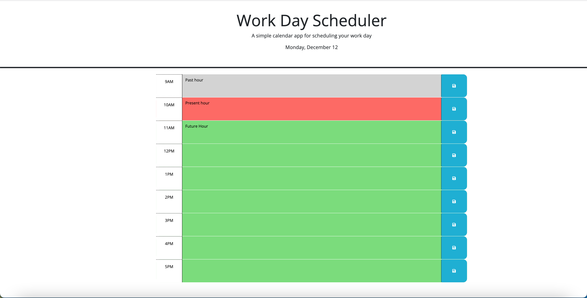

# my-calendar

## Description 

This is a simple calendar application that allows an user to save the events of the day from 9am - 5pm. The starter code containing HTML and CSS was provided, the challenge here was to build the logic. Give it a try!!

## Features

* It is responsive, this feature is implemented in the starter code. 
* The calendar displays hours of the day from 9am - 5pm and they are color coded to show the past hour as gray, present hour as red and the future hour as green.  
* Click on the block beside the hour and you can enter your notes.
* Click on the save button beside the text area with a lock icon to save your notes.
* When you refresh the page your notes will be saved in local storage and hence persists, you can also edit the notes to make any changes.

## Installation

N/A

## Screenshot

## Link to the deployed application

https://suvarna28.github.io/my-calendar/

## Credits

* W3schools for jquery tutorials.
* Stackoverflow for syntax of the jquery traversal elements.

